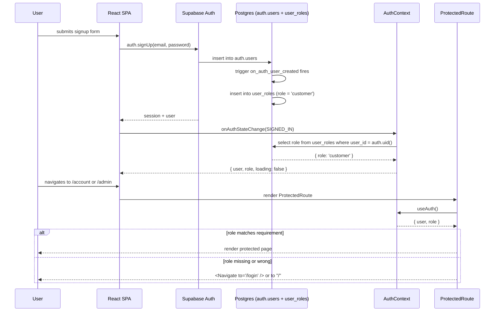

# Component Hierarchy

This document maps out the React component tree for the CIS329 full-stack
project, shows which components own which Supabase queries, and describes
how auth state flows from signup all the way to a protected route.

## Component tree

```
main.jsx
└── BrowserRouter (react-router-dom)
    └── AuthProvider                 (owns user + role + session state)
        └── App
            ├── SkipLink (a.skip-link -> #main-content)
            ├── Navbar                (reads user + role from AuthContext)
            ├── main#main-content (tabIndex={-1}, focused on route change)
            │   └── Routes
            │       ├── /         -> HomePage
            │       │                  └── ProductCard (x N, N >= 10)
            │       ├── /login    -> LoginPage
            │       ├── /signup   -> SignupPage
            │       ├── /profile  -> ProtectedRoute
            │       │                  └── ProfilePage (order history table)
            │       ├── /admin    -> ProtectedRoute requireAdmin
            │       │                  └── AdminPage (products CRUD)
            │       └── *         -> NotFoundPage
            └── footer.site-footer
```

Supporting components:
- `ProtectedRoute` wraps routes that need auth (optionally admin-only)
- `Spinner` provides an accessible loading indicator (role="status")
- `ProductCard` is the only reusable product visual; used only by HomePage in this build

## Where Supabase is called

The goal is to keep Supabase calls close to the component that actually
needs the data, with two exceptions: auth state lives in `AuthContext`
and cart state lives in `CartContext`. Everything else queries where it
renders.

| Component       | Query or mutation                                                              | Notes                                                  |
| --------------- | ------------------------------------------------------------------------------ | ------------------------------------------------------ |
| `AuthProvider`  | `auth.getSession`, `auth.onAuthStateChange`, `from('user_roles').select()`     | Owns user + role. Re-fetches role on every sign in.    |
| `LoginPage`     | `auth.signInWithPassword`, `auth.signInWithOAuth('google')`                    | Redirects to `location.state.from` or `/` on success.  |
| `SignupPage`    | `auth.signUp`, `auth.signInWithOAuth('google')`                                | DB trigger inserts the `user_roles` row automatically. |
| `HomePage`      | `from('products').select('*').order('name')` in `useEffect` on mount           | Renders 10+ products. Public read, works for anon.     |
| `ProductCard`   | `from('orders').insert({ product_id, quantity, total_price })`                 | `user_id` defaults to `auth.uid()` server-side.        |
| `ProfilePage`   | `from('orders').select('id, quantity, total_price, created_at, products(name, image_url)').order('created_at', { ascending: false })` | RLS scopes this to the current user. |
| `AdminPage`     | `from('products').select/insert/update/delete`                                 | RLS gates every write on `is_admin()`.                 |

## Global state flow

One context, mounted high in the tree:

- **AuthContext** (from `AuthProvider`) exposes `{ user, role, loading, signIn, signUp, signInWithOAuth, signOut }`.
  - `user` is the Supabase `User` object or `null`.
  - `role` is `'customer'`, `'admin'`, or `null` while loading.
  - `loading` stays `true` until the initial session check and the
    matching `user_roles` lookup both resolve. `ProtectedRoute` renders
    a spinner while this is true so we never flash the login page at a
    user who is actually signed in.

There is no cart context in this build. "Buy" on a product card is a
single-click insert into `orders` with `quantity=1`, which keeps the flow
focused on what the assignment rubric actually grades: auth, protected
routes, role-based access, and admin CRUD.

`ProtectedRoute` is a thin wrapper that reads from `AuthContext`:

```jsx
function ProtectedRoute({ children, requireAdmin = false }) {
    const { user, role, loading } = useAuth();
    if (loading) return <Spinner />;
    if (!user) return <Navigate to="/login" replace />;
    if (requireAdmin && role !== 'admin') return <Navigate to="/" replace />;
    return children;
}
```

The client-side role check is only for UX (hiding the admin nav link,
redirecting away from `/admin`). The real enforcement is the RLS
policies in `rls-policies.sql`, so a user who pokes at the network tab
and fires an admin mutation directly still gets a 401 back.

## Auth flow diagram



The admin variant of this flow is identical except a project owner
manually updates `user_roles.role` to `'admin'` for that user in the
Supabase SQL editor. Next time the user signs in, `AuthContext` picks
up the new role and the admin nav appears.
